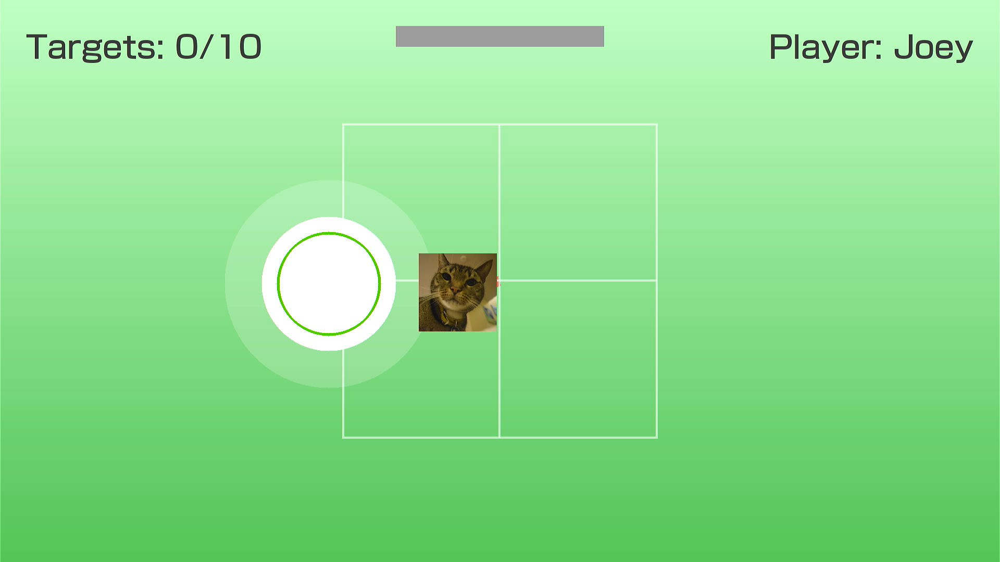

# ai-balance-rehab-game
An AI generated (stupid) game that uses the Wii balance board for controlling a player to get score.



Config:
-------

### Change the MAC address (Line 106) to the one you see when connecting the board to Bluetooth

### At lines 30 and 31 change the resolution to the one of your display

### Change line 42 to the refresh rate you currently have

### Lines 143-145 have the player configurations, change the images and names to what you want.

Audio:
------

### For audio, please add the following files in the same directory as the game: main\_intro.wav, transition.wav, connection\_main.wav, connection\_intro.wav, and main\_loop.wav

### Note: The files that start with "main" are used on the main game screen (NOT the connection screen). The files that start with "connection" are used on the connection screen. The file with the word "transition" is used during the transition between the connection and "main game" screens.

Files:
------

### Make sure you have in the same directory a file called "shingom.otf" for the font Shin Go Medium

Compiling:
----------

To compile the game, run ```sudo apt update
sudo apt install -y build-essential git cmake pkg-config libsdl2-dev libsdl2-ttf-dev libsdl2-mixer-dev libsdl2-image-dev libxwiimote-dev libbluetooth-dev pulseaudio pulseaudio-utils``` for Debian/Ubuntu,
```sudo dnf install -y gcc make cmake pkgconfig SDL2-devel SDL2_ttf-devel SDL2_mixer-devel SDL2_image-devel xwiimote-devel bluez-libs-devel pulseaudio-utils``` for Fedora/CentOS/RHEL,
or ```sudo pacman -S gcc make cmake pkgconfig sdl2 sdl2_ttf sdl2_mixer sdl2_image xwiimote bluez-utils pulseaudio mesa``` for Arch,
then run ```gcc -o game game.c $(sdl2-config --cflags --libs) -lSDL2_image -lSDL2_ttf -lSDL2_mixer -lxwiimote -lbluetooth -lm```
